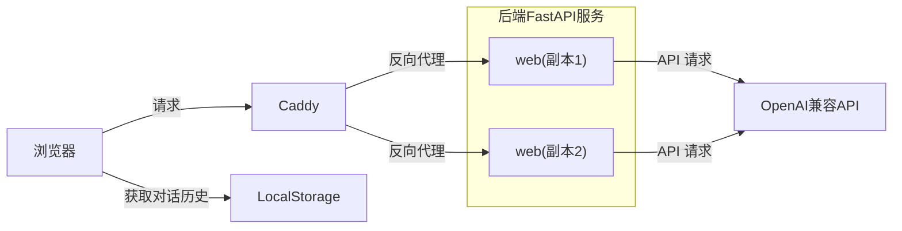

# simple-llm-web

一个基于`FastAPI`的简易大模型问答Web服务，支持接入通用OpenAI兼容API，使用Docker Compose部署。

> [!CAUTION]
> 本项目旨在完成[@LanshanTeam](https://github.com/LanshanTeam/)的寒假任务。
> 如果你在寻找类似软件，我推荐使用[chatgpt-demo](https://github.com/anse-app/chatgpt-demo)。其使用Astro编写，支持Serverless部署。

## 特性

- 使用OpenAI兼容API调用大模型
- 使用LocalStorage保存问答历史
- 前端是AI写的



## 运行

复制并修改环境变量：

```bash
cp .env.example .env
```

| 变量名 | 说明 | 示例 |
| --- | --- | --- |
| `OPENAI_API_KEY` | 模型平台 API Key | `sk-xxxx` |
| `OPENAI_BASE_URL` | OpenAI 兼容 API 地址 | `https://api.deepseek.com/v1` |
| `MODEL_NAME` | 使用的模型名 | `deepseek-chat` |
| `MAX_TOKENS` | 单次回答最大 tokens | `2048` |

### 本地开发运行

使用`uv`安装依赖：

```bash
uv sync
uv run uvicorn app.main:app --reload --host 0.0.0.0 --port 8000
```

访问：`http://localhost:8000`

### Docker Compose 运行

```bash
docker compose up -d --build
```

如果当前 Docker Compose 版本未应用 `deploy.replicas`，可使用：

```bash
docker compose up -d --build --scale web=2
```

访问：`http://localhost`
